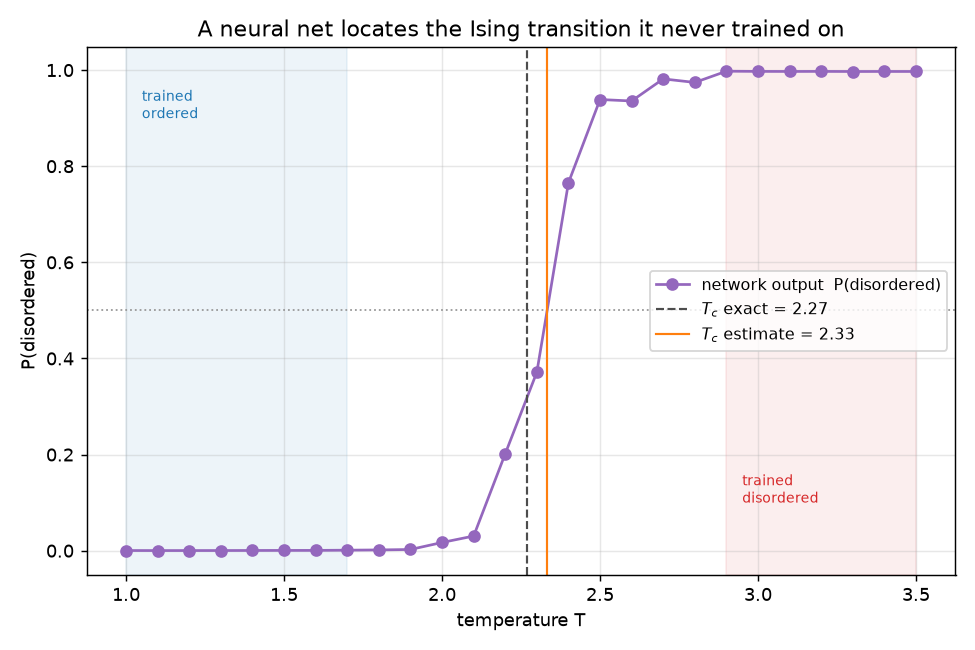
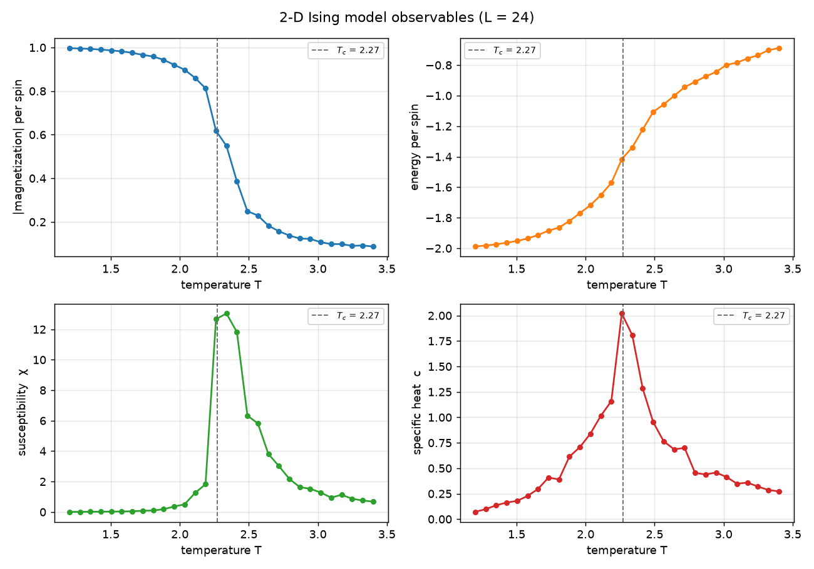

# ml-ising-phases

**Can a neural network discover a phase transition it was never told about?**
Yes — this project reproduces the central result of Carrasquilla & Melko,
*Machine learning phases of matter* (Nature Physics, 2017), end to end:

1. **Simulate** the 2-D Ising model with a vectorized Metropolis Monte Carlo.
2. **Train** a small neural net to tell *ordered* from *disordered* using only
   configurations drawn **deep** in each phase (no knowledge of `T_c`).
3. **Recover `T_c`**: ask the network about the critical region it never saw —
   its `P(disordered)` output crosses ½ within **2.8%** of the exact Onsager
   value `T_c = 2/ln(1+√2) ≈ 2.269`.



---

## Why this project

It connects three things I want to be good at: **statistical physics** (the
Ising model and critical phenomena), **scientific computing** (a fast,
vectorized Monte Carlo), and **machine learning** (training and interpreting a
classifier on real generated data). The result is genuinely surprising — the
network learns the order parameter on its own — which makes it a great vehicle
for showing the whole pipeline rather than a toy.

## The physics is right first

Before any ML, the Monte Carlo reproduces the transition from observables alone.
Magnetization collapses at `T_c`; susceptibility `χ` and specific heat `c` peak
there (`examples/physics_demo.py`, L = 24):

```
T_c (exact)               = 2.269
T_c (specific-heat peak)  = 2.262
T_c (susceptibility peak)  = 2.338
```



The configurations themselves tell the story — aligned below `T_c`, fractal-like
clusters *at* `T_c`, and random noise above it:


## Then the machine learns it

`examples/ml_demo.py` trains an MLP on the shaded regions only (deep ordered +
deep disordered) and predicts across the full range:

```
train accuracy (deep phases):     1.000
T_c estimate (P = 1/2 crossing):  2.333
T_c exact (Onsager):              2.269
relative error:                   2.8%
```

The network is never shown a configuration near `T_c`, yet its output crosses ½
right at the transition — it has learned the order parameter purely from the raw
spins.

## Quickstart

```bash
pip install -r requirements.txt    # numpy, scikit-learn, matplotlib, pytest

python -m pytest -q                # 8 tests: physics + ML pipeline
python examples/physics_demo.py    # observables vs T  (figures)
python examples/ml_demo.py         # train + recover T_c (figures)
```

### Use it

```python
from ising import montecarlo as mc

sim = mc.simulate(L=32, T=2.0, n_eq=1000, n_samples=100)
print(sim["abs_M"].mean())         # ~0.9 (ordered, below T_c)

from ising import model
r = model.estimate_tc(L=24)
print(r["tc_estimate"], r["tc_exact"])
```

## How it works

**Monte Carlo.** Spins update by a **checkerboard** Metropolis sweep: the two
sublattices are conditionally independent (same-color sites are never
neighbors), so each color is flipped in one vectorized NumPy step using
`np.roll` for the periodic neighbor sums. Accept a flip with probability
`min(1, e^{-ΔE/T})`.

**Learning.** Each L×L configuration is flattened to a feature vector in
`{-1,+1}`. A one-hidden-layer `MLPClassifier` is trained on the confident
extremes only. Because the order parameter `|M|` is a *nonlinear* function of
the spins, the hidden layer is what lets the network represent it — a linear
classifier on raw spins cannot, which is itself a nice lesson.

**Finding `T_c`.** Average `P(disordered)` over the samples at each temperature
and linearly interpolate the `P = ½` crossing.

## Project layout

```
ising/
  montecarlo.py   # Metropolis sweep, observables, thermodynamics()
  dataset.py      # labeled configurations across temperatures
  model.py        # train classifier, estimate T_c
examples/         # physics_demo.py, ml_demo.py (+ figures)
tests/            # 8 pytest checks
```

## References

- J. Carrasquilla & R. Melko (2017), *Machine learning phases of matter*,
  Nature Physics 13, 431.
- L. Onsager (1944), exact solution of the 2-D Ising model.
- K. Binder & D. Heermann, *Monte Carlo Simulation in Statistical Physics*.

## License

MIT — see [LICENSE](LICENSE).
