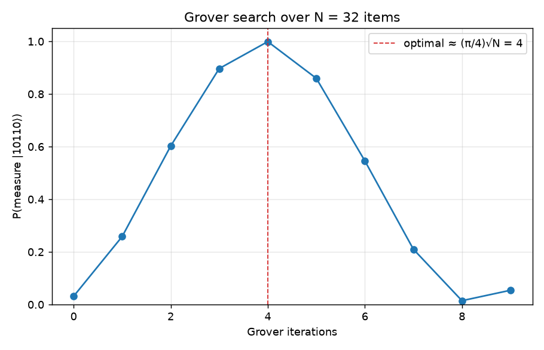

# quantum-algorithms

A **quantum-circuit simulator written from scratch in NumPy**, plus clean
implementations of three canonical quantum algorithms built on top of it. No
Qiskit, no Cirq — the point is to show the linear algebra underneath, not to
call a library.

- **`qsim`** — an exact statevector simulator. Stores an `n`-qubit state as a
  rank-`n` tensor and applies gates by contraction in `O(2^n)`, so it never
  builds the full `2^n × 2^n` operator and Grover scales to ~12 qubits on a
  laptop.
- **Algorithms** — Grover search, quantum teleportation, and Deutsch–Jozsa,
  each written so the code reads like the circuit diagram.



---

## Why this project

Quantum computing sits exactly on the physics/CS boundary I care about. Writing
the simulator myself — gate application via tensor contraction, projective
measurement with state collapse, the Born rule — forced me to understand how a
quantum computer actually evolves a state, rather than treating it as a black
box. The three algorithms then exercise the interesting ideas: amplitude
amplification, entanglement as a resource, and quantum parallelism.

## What's inside

| Algorithm | Idea it demonstrates | Result |
|---|---|---|
| **Grover search** | amplitude amplification | finds 1 of `N` items in `~√N` queries |
| **Teleportation** | entanglement + classical communication | fidelity `1.000000`, no-cloning respected |
| **Deutsch–Jozsa** | quantum parallelism | constant-vs-balanced in **one** query |

### Grover's search

Searching `N = 32` items for a marked state, the simulator amplifies it to near
certainty in 4 iterations — where classical brute force needs ~16 checks:

```
searching 32 = 2^5 items for |10110>
Grover iterations used: 4  (classical brute force needs ~16)
probability of measuring the marked state: 0.9992
top measurement outcomes (1000 shots):
  |10110>: 997
  |01011>: 1
  |00111>: 1
```

The figure above shows the success probability rising to ~1 at the optimal
`(π/4)√N` iterations and then *over-rotating* back down — the hallmark of
amplitude amplification.

### Quantum teleportation

An unknown qubit `0.6|0⟩ + 0.8i|1⟩` is moved from Alice to Bob across all four
Bell-measurement outcomes, each recovered with unit fidelity:

```
trial 0: Alice measured (1,0) -> Bob holds 0.600+0.000j|0> + 0.000+0.800j|1>   fidelity=1.000000
trial 1: Alice measured (1,1) -> Bob holds 0.600+0.000j|0> + 0.000+0.800j|1>   fidelity=1.000000
trial 2: Alice measured (0,0) -> Bob holds 0.600+0.000j|0> + 0.000+0.800j|1>   fidelity=1.000000
```

## Quickstart

```bash
pip install -r requirements.txt     # numpy + pytest (matplotlib only for the plot)

python -m pytest -q                 # 34 tests: gates, simulator, algorithms
python examples/grover_demo.py
python examples/teleportation_demo.py
python examples/grover_plot.py       # regenerates the figure above
```

### Build your own circuit

```python
from qsim import Register, gates

reg = Register(2)            # |00>
reg.apply(gates.H, [0])      # superposition on qubit 0
reg.apply(gates.CNOT, [0, 1])  # entangle -> Bell state
print(reg.prob_dict())       # {'00': 0.5, '11': 0.5}
print(reg.sample(shots=1000))  # measurement statistics
```

## How the simulator works

A state is a complex tensor of shape `(2,) * n`. Applying a `k`-qubit gate `U`
is a tensor contraction of `U`'s input legs with the targeted qubit axes:

```python
U = U.reshape([2]*k + [2]*k)                       # outputs | inputs
state = np.tensordot(U, state, axes=(inputs, qubits))
state = np.moveaxis(state, range(k), qubits)        # put axes back
```

Measurement marginalizes `|amplitude|²` over the other qubits, samples an
outcome, projects out the inconsistent half, and renormalizes — the Born rule
plus wavefunction collapse, made explicit.

## Project layout

```
qsim/
  gates.py        # X, Y, Z, H, S, T, rotations, CNOT, CZ, SWAP, controlled()
  statevector.py  # Register: apply / measure / sample
  algorithms.py   # grover, teleport, deutsch_jozsa
examples/         # runnable demos (+ the Grover figure)
tests/            # 34 pytest checks
```

## References

- M. A. Nielsen & I. L. Chuang, *Quantum Computation and Quantum Information*.
- L. K. Grover (1996), *A fast quantum mechanical algorithm for database search*.
- Bennett et al. (1993), *Teleporting an unknown quantum state*.

## License

MIT — see [LICENSE](LICENSE).
