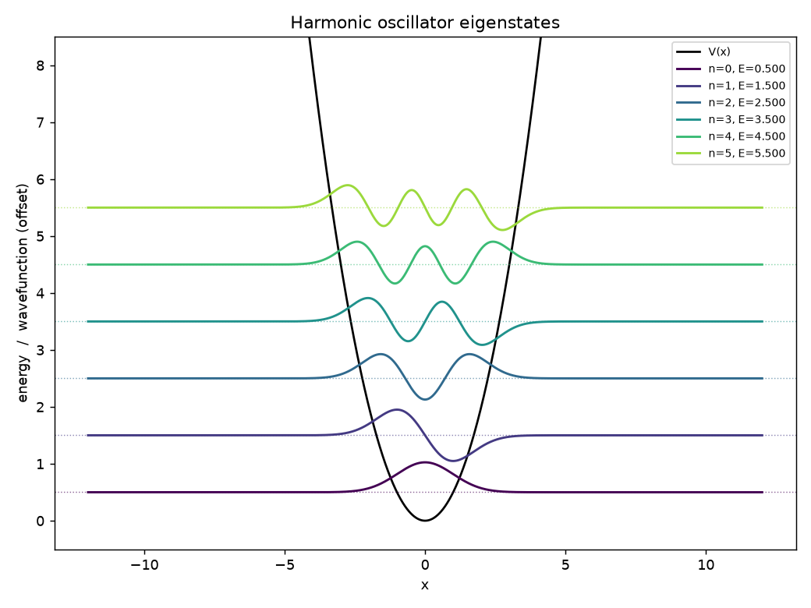
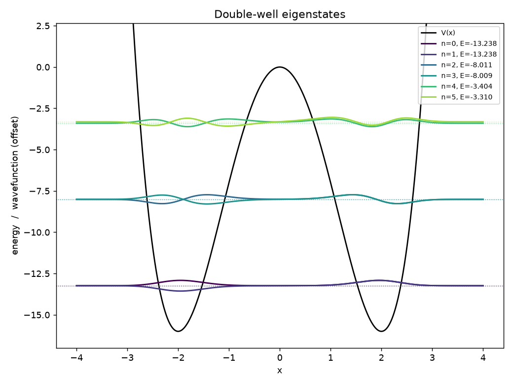
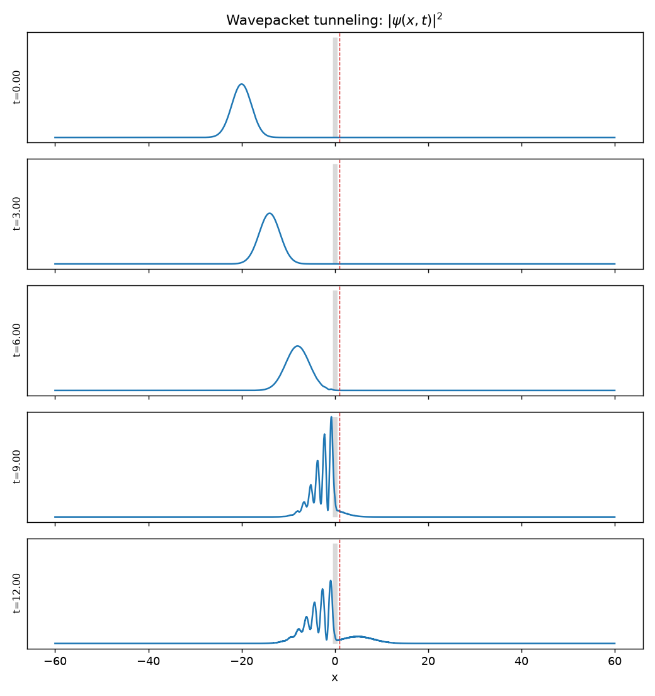

# schrodinger-solver

A small, well-tested **1-D Schrödinger equation solver** in Python. It does two
things, and tries to do them honestly:

1. **Bound states** (time-independent equation) for an *arbitrary* potential,
   via a finite-difference Hamiltonian and a sparse eigensolver.
2. **Wavepacket dynamics** (time-dependent equation) via the **split-step
   Fourier method**, which is unitary to machine precision and conserves the
   norm exactly.

Every result is checked against a closed-form answer — infinite-square-well and
harmonic-oscillator spectra, and the analytic barrier-transmission coefficient
— so the tests verify *physics*, not just that the code runs.



---

## Why this project

Quantum mechanics problems almost never have closed-form solutions once the
potential is anything but a textbook special case. The two workhorses below —
diagonalizing a discretized Hamiltonian, and propagating a state with operator
splitting — are exactly how you attack the general case numerically. This repo
implements both from scratch (NumPy/SciPy only), validates them, and visualizes
the results.

## Highlights

- **Arbitrary potentials.** Harmonic, finite/infinite well, rectangular
  barrier, quartic double well, linear field — or pass your own `V(x)`.
- **Sparse and fast.** The Hamiltonian is assembled as a sparse tridiagonal
  matrix; only the lowest-lying states are computed (`scipy.sparse.linalg.eigsh`).
- **Unitary time evolution.** Strang-split FFT propagator; norm conserved to
  ~10⁻¹⁰ over thousands of steps.
- **Validated.** 10 `pytest` tests compare against analytic spectra and
  transmission coefficients.

## Results

### Spectra match theory to ~10⁻⁶

Running `examples/eigenstates_demo.py`:

| system | level | numerical | analytic | rel. error |
|---|---|---|---|---|
| infinite square well | n=1 | 4.924937 | 4.924938 | 2×10⁻⁷ |
| infinite square well | n=3 | 44.324356 | 44.324438 | 2×10⁻⁶ |
| harmonic oscillator | n=0 | 0.499998 | 0.500000 | 4×10⁻⁶ |
| harmonic oscillator | n=5 | 5.499878 | 5.500000 | 2×10⁻⁵ |

The **quartic double well** `V(x) = x⁴ − 8x²` reproduces the hallmark
near-degenerate ground-state doublet (symmetric/antisymmetric tunneling pair):
`E₀ = −13.237609`, `E₁ = −13.237593`, a splitting of `1.6×10⁻⁵` — five orders of
magnitude below the gap to the next level.



### Tunneling matches the plane-wave coefficient

Running `examples/tunneling_demo.py` sends a Gaussian wavepacket
(mean energy `E₀ = 2.0`) at a barrier of height `V₀ = 3.0` — squarely in the
tunneling regime:

```
transmitted probability (wavepacket): 0.1806
plane-wave transmission T(E0):        0.1918
norm conserved:                       1.0000000000
```

The two agree to within the wavepacket's finite energy spread. You can watch the
incident packet split into a reflected part (interfering with itself on the
left) and a transmitted part that leaks through the barrier:



## Quickstart

```bash
pip install -r requirements.txt        # numpy, scipy, matplotlib, pytest
# (optional) install as a package:  pip install -e .

python -m pytest -q                    # run the 10 validation tests
python examples/eigenstates_demo.py    # spectra + figures
python examples/tunneling_demo.py      # tunneling + figure
```

### Use it

```python
from schrodinger import build_grid, solve, potentials

x, _ = build_grid(-10, 10, 2000)
states = solve(x, potentials.harmonic(omega=1.0), k=5)
print(states.energies)        # [0.5, 1.5, 2.5, 3.5, 4.5]

# Time-dependent: a wavepacket in any potential
from schrodinger import SplitStepSolver, gaussian_wavepacket
solver = SplitStepSolver(x, potentials.harmonic(omega=1.0))
psi0 = gaussian_wavepacket(x, x0=-3, k0=0, sigma=1.0)
times, frames = solver.evolve(psi0, dt=0.01, steps=500, save_every=50)
```

## How it works

**Time-independent.** Discretize `x` on a uniform grid and approximate the
kinetic operator with the three-point second-derivative stencil. The
Hamiltonian becomes a symmetric tridiagonal matrix
`H = -ħ²/(2m) D² + diag(V(xᵢ))`; its lowest eigenpairs are the bound-state
energies and wavefunctions. Dirichlet boundary conditions put the walls half a
grid step beyond the domain, so the effective box width is `(N+1)·dx` — a detail
the infinite-square-well test accounts for.

**Time-dependent.** Split the evolution operator symmetrically:

```
ψ(t+dt) = e^{-iV dt/2ħ} · F⁻¹ e^{-iħk² dt/2m} F · e^{-iV dt/2ħ} ψ(t)
```

The potential half-steps are diagonal in position space; the kinetic full-step
is diagonal in momentum space (hence the FFTs). Each factor is a pure phase, so
the scheme is exactly unitary and second-order accurate in `dt`.

## Project layout

```
schrodinger/
  potentials.py   # V(x) factories: harmonic, well, barrier, double well, ...
  tise.py         # finite-difference Hamiltonian + sparse eigensolver
  tdse.py         # split-step Fourier propagator + diagnostics
  analytic.py     # closed-form references for validation
  plotting.py     # figure helpers (headless-safe)
examples/         # runnable demos that produce the figures above
tests/            # 10 pytest checks against analytic results
```

## References

- D. J. Griffiths, *Introduction to Quantum Mechanics* — square-well/QHO spectra,
  barrier transmission.
- J. J. Sakurai, *Modern Quantum Mechanics*.
- Feit, Fleck & Steiger (1982), *Solution of the Schrödinger equation by a
  spectral method* — the split-step Fourier propagator.

## License

MIT — see [LICENSE](LICENSE).
